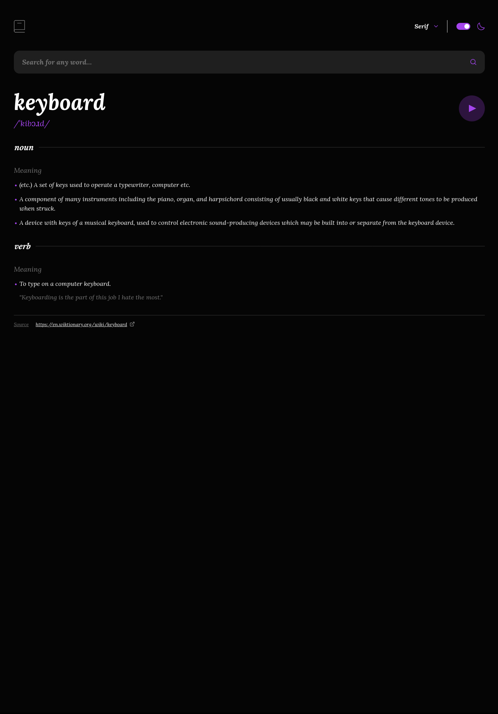

# Frontend Mentor - Dictionary web app solution

This is a solution to the [Dictionary web app challenge on Frontend Mentor](https://www.frontendmentor.io/challenges/dictionary-web-app-h5wwnyuKFL). Frontend Mentor challenges help you improve your coding skills by building realistic projects.

## Table of contents

- [Overview](#overview)
  - [The challenge](#the-challenge)
  - [Screenshot](#screenshot)
  - [Links](#links)
- [My process](#my-process)
  - [Built with](#built-with)
  - [What I learned](#what-i-learned)
  - [Continued development](#continued-development)
  - [Useful resources](#useful-resources)
- [Author](#author)
- [Acknowledgments](#acknowledgments)

**Note: Delete this note and update the table of contents based on what sections you keep.**

## Overview

### The challenge

Users should be able to:

- Search for words using the input field
- See the Free Dictionary API's response for the searched word
- See a form validation message when trying to submit a blank form
- Play the audio file for a word when it's available
- Switch between serif, sans serif, and monospace fonts
- Switch between light and dark themes
- View the optimal layout for the interface depending on their device's screen size
- See hover and focus states for all interactive elements on the page
- **Bonus**: Have the correct color scheme chosen for them based on their computer preferences. _Hint_: Research `prefers-color-scheme` in CSS.

### Screenshot



### Links

- Solution URL: [Add solution URL here](https://github.com/ttsoares/web-dictionay)
- Live Site URL: [Add live site URL here](https://web-dictionay-1txzp8hgn-thomas-tsoares-projects.vercel.app/)

## My process

### Built with

- Functionaly first
- Static styling second
- Then dinamic styling
- Desktop-first workflow
- [React](https://reactjs.org/) - JS library
- [TailwindCSS](https://tailwindcss.com/) - For styles

### What I learned

Improoved the use of strong variables typing (TS) in React.

```tsx
interface InnerAppProps {
  currentFont: string;
  setCurrentFont: Dispatch<SetStateAction<string>>;
  fontClass: string;
  theme: string;
  setTheme: Dispatch<SetStateAction<string>>;
}
```

### Continued development

However, plain JavaScript often feels more fluid for UI coding... AIs can generate JSDoc to improve documentation and readability. But only with TypeScript is it highly likely that what the IDE displays will actually run.

### Useful resources

- [101 React Tips & Tricks](https://dev.to/_ndeyefatoudiop/101-react-tips-tricks-for-beginners-to-experts-4m11) - In this article, I share the 101 best tips & tricks I learned over the years.

## Author

- Website - [Thomas TS](https://buildesign.vercel.app/)
- Frontend Mentor - [@ttsoares](https://www.frontendmentor.io/profile/ttsoares)
- Linkedin - [thomas-soares-6791781b/](https://www.linkedin.com/in/thomas-soares-6791781b/)

## Acknowledgments

Mentorship of different AIs like ChatGPT, DeepSeek and Windsurf.
